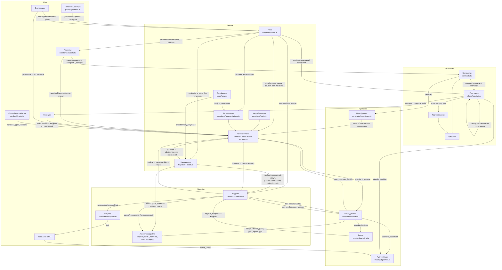

# 🗺️ Карта взаимосвязей игровых систем

Назначение: понять, какие элементы игры затрагиваются при добавлении/изменении сущности (раса, модуль, профессия, технология и т.д.).

---

## Общая схема

---

## Ключевые цепочки

- **Уровень экипажа → эффективность**: уровень входит в формулы назначений (например, наука учёного = `(5 + уровень) × 2` при назначении `research`). Опыт капает из контрактов (`constants/experience.ts`), назначений и экспедиций.
- **Модуль → атрибуты корабля**: каждый модуль даёт/потребляет энергию, кислород, ёмкости (`slices/ship`). Отключение модуля (дефицит энергии, урон) каскадно бьёт по всем зависимым системам.
- **Модуль → назначения**: многие задачи требуют нахождения в конкретном модуле (см. `docs/CREW_ASSIGNMENTS.md`).
- **Ксеноморф → модуль**: сращивание даёт бонус в зависимости от типа модуля (см. `docs/XENOSYMBIONT_MERGE.md`). Новый тип модуля = нужен эффект сращивания.
- **Репутация → каскад**: изменение репутации с расой пересчитывается на её `relations` (см. `docs/REPUTATION_TRADEOFFS.md`), влияет на цены, контракты, враждебность в секторах.
- **Исследования → всё**: `ResearchBonusType` покрывает модули, оружие, экипаж, груз, щиты, экспедиции, артефакты; технологии открывают рецепты крафта и новые модули.

---

## Чек-листы влияния

### ➕ Новая раса

| Что править | Где |
|---|---|
| `RaceId`, `RaceTraitId`, эффекты | `types/races.ts` |
| Определение расы: бонусы, relations, среда | `constants/races.ts` |
| **Relations у ВСЕХ существующих рас** (двусторонние) | `constants/races.ts` |
| Спрайт | `public/assets/races.webp` + `components/RaceSprite.tsx` |
| Переводы | `lib/locales/ru.json`, `en.json` |
| Генерация галактики (сектора расы) | `galaxy/generate.ts` |
| Планеты: environmentPreference, `requiredRace` | `constants/planets.ts`, `types/planets.ts` |
| Репутация: стартовые значения | `slices/reputation`, `initial/initialState.ts` |
| Найм экипажа | `slices/crewManagement/utils/hireCrew.ts`, `crew/buildCrewMember.ts` |
| Расовая аугментация | `types/augmentations.ts`, `constants/augmentations.ts` |
| Спец-механика расы (если есть, как merge у ксеноморфов) | `slices/crew`, `types/crew.ts` |
| Вражеские корабли расы | `constants/shipTemplates.ts` |
| Экспедиции: веса тайлов | `slices/locations/helpers/expedition/tileWeights.ts` |
| Контракты (расовые), станции | `contracts/generatePlanetContracts.ts`, `components/station/station-data.ts` |
| Стартовые модификаторы (если завязаны на расу) | `constants/launchModifiers.ts` |
| Документация | `docs/` (при наличии спец-механики) |

### ➕ Новый тип модуля

| Что править | Где |
|---|---|
| `ModuleType` | `types/modules.ts` |
| Данные по уровням: энергия, HP, защита | `constants/modules.ts` |
| Эффект сращивания ксеноморфа | доки `XENOSYMBIONT_MERGE.md` + хелперы merge |
| Назначения экипажа, привязанные к модулю | `types/crew.ts`, обработчики в `slices/gameLoop/processors/crewAssignments` |
| Пересчёт атрибутов корабля | `slices/ship` |
| Технология-разблокировка (`new_module`) | `constants/research/` |
| Крафт (если гибридный) | `constants/crafting.ts`, `types/crafting.ts` |
| UI схемы корабля, спрайты | `game/components`, `public/assets` |
| Переводы | локали |

### ➕ Новая профессия

- `Profession` в `types/crew.ts`, назначения (мирные/боевые) + их обработчики в `gameLoop/processors/crewAssignments`
- Проф. аугментация (`augmentations.ts`), спрайт `public/assets/professions/`
- Найм/генерация экипажа, шаблоны кораблей, локали, `docs/CREW_ASSIGNMENTS.md`

### ➕ Новая технология

- `TechnologyId` + дерево (`constants/research/tierN.ts`): prerequisites, ресурсы, бонусы
- Если бонус нового типа — `ResearchBonusType` + применение в соответствующем слайсе
- Если открывает модуль/оружие/рецепт — соотв. константы + крафт
- Локали, `docs/RESEARCH_SYSTEM.md`, `TECHNOLOGY_STATUS.md`

### ➕ Новый тип контракта

- `ContractType` (`types/contracts.ts`), генерация (`contracts/`), обработка выполнения (`slices/contracts`)
- Награды: кредиты, репутация (+ каскад по relations), опыт (`constants/experience.ts` — `CONTRACT_REWARDS`)
- Цели победы, если завязаны на контракты; локали

### ✏️ Изменение баланса назначения экипажа

- Формула в обработчике (`gameLoop/processors/crewAssignments/`), описание в `docs/CREW_ASSIGNMENTS.md`
- Проверить: бонусы рас (`crewBonuses`), черты, аугментации и сращивание — все мультипликаторы одного эффекта складываются

### ✏️ Изменение репутации/отношений

- `relations` в `constants/races.ts` двусторонние — менять у обеих рас
- Каскад считается в `slices/reputation`; влияет на цены (`reputation/priceModifier.ts`), контракты, `galactic_coalition`

---

## Правило общего порядка правок

Из `AGENTS.md`: docs → types → constants → slices/helpers → UI → locales → docs → `type-check` + `lint`.
